# 🎓 FIAP Portal Acadêmico (Mobile) - CP2

## 📑 Índice

1. [📌 Sobre o Projeto](#-sobre-o-projeto)
2. [👥 Integrantes do Grupo](#-integrantes-do-grupo)
3. [🛠️ Como Rodar o Projeto](#-como-rodar-o-projeto)
4. [🎬 Demonstração Visual](#-demonstração-visual)
5. [🧠 Decisões Técnicas](#-decisões-técnicas)
6. [🌟 Diferencial Implementado](#-diferencial-implementado)
7. [🔮 Próximos Passos](#-próximos-passos)


## 📌 Sobre o Projeto

O **FIAP Portal Acadêmico** é uma aplicação mobile desenvolvida com React Native + Expo que centraliza funcionalidades essenciais da vida acadêmica em um único ambiente digital.

O aplicativo resolve o problema da **fragmentação de informações acadêmicas**, reunindo dados como notas, faltas e calendário em uma interface moderna, intuitiva e personalizada.


### 🎯 CheckPoint 2

Neste checkpoint, o foco foi a **Arquitetura de Estado e Persistência de Dados**, evoluindo o protótipo do CP1 para uma aplicação funcional com:

* Autenticação de usuários
* Navegação protegida
* Persistência de dados locais
* Interface dinâmica com tema


### 🚀 Melhorias em relação ao CP1

* 🔐 Implementação de autenticação com controle de sessão
* 💾 Persistência de dados com **SecureStore**
* 👥 Separação de perfis: **Aluno e Professor**
* 🎨 Suporte a tema dinâmico (claro/escuro)
* 🔄 Refatoração completa para uso de Context API
* 📊 Boletim interativo com regras de cálculo


### ✅ Funcionalidades Implementadas

* Login e Cadastro com validação

* Boletim acadêmico:
  * Visualização (Aluno)
  * Edição (Professor)
  * Cálculo automático de médias

* Calendário acadêmico:
  * Visualização de eventos
  * Criação e remoção de eventos (Professor)

* Navegação por abas
* Persistência de dados local
* Tema dinâmico com Context


## 👥 Integrantes do Grupo

* **Alice Santos Bulhões** - RM554499
* **Eduardo Oliveira Cardoso Madid** - RM556349
* **Nicolas Haubricht Hainfellner** - RM556259
* **Guilherme da Cunha Melo** - RM555310


## 🛠️ Como Rodar o Projeto

### 📋 Pré-requisitos

* Node.js (LTS)
* npm ou yarn
* Expo SDK 51+
* Expo Go (celular ou emulador)


### ▶️ Passo a Passo

```bash
# Clonar o repositório
git clone https://github.com/L-A-N-E/FIAP-MDI-CP2-Portal-App

# Entrar na pasta
cd FIAP-MDI-CP2-Portal-App

# Instalar dependências
npm install

# Rodar o projeto
npx expo start
```

Após isso:

* Escaneie o QR Code com o Expo Go
* Ou pressione `a` (Android) / `i` (iOS)


## 🎬 Demonstração Visual

### 🖼️ Prints das Telas

* Tela de Login

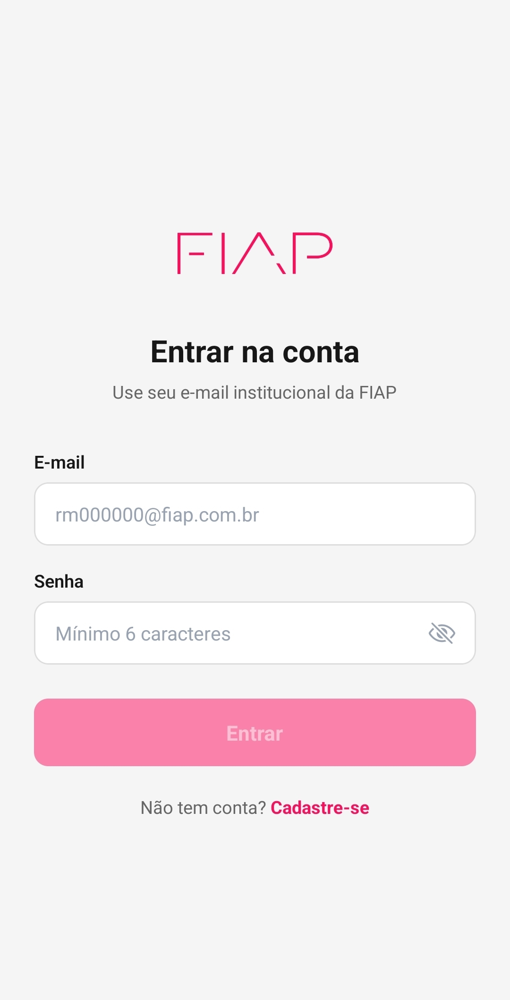

* Tela de Cadastro

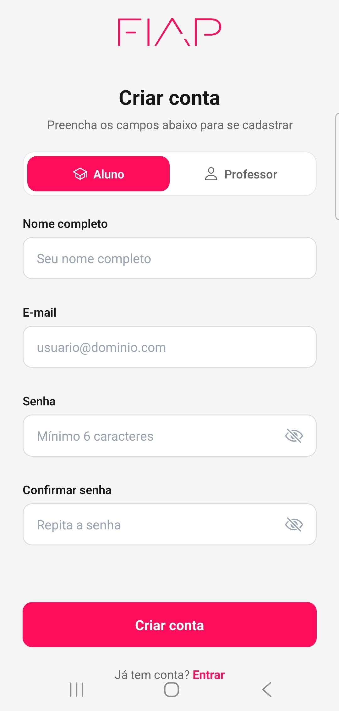
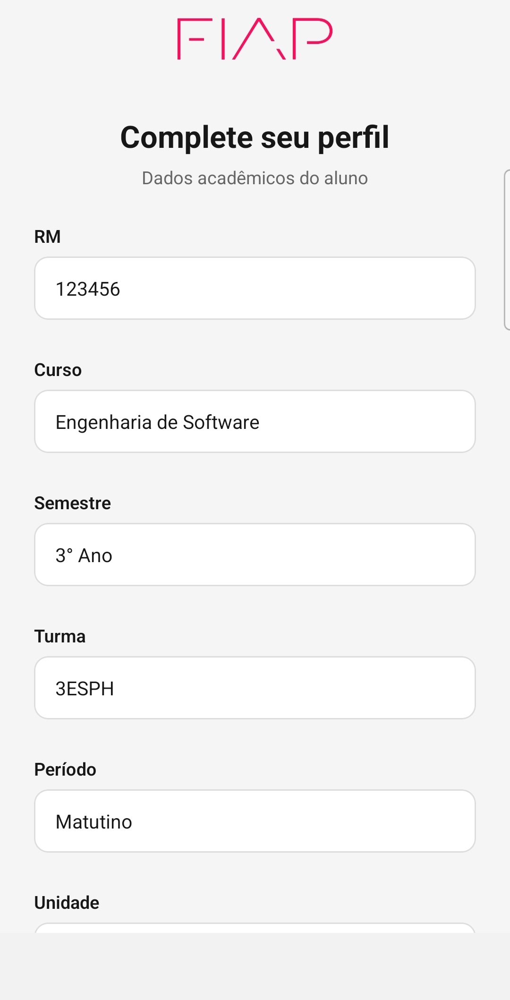

* Home

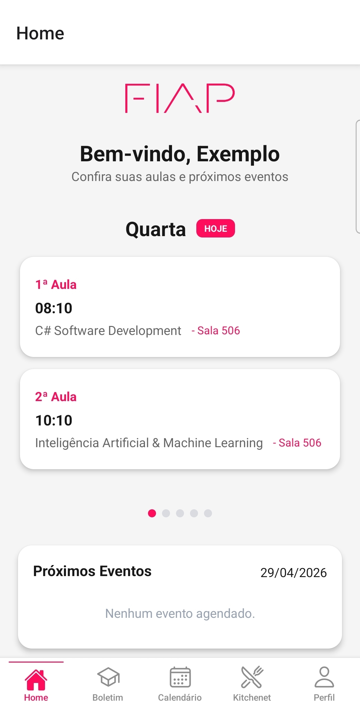

* Boletim Acadêmico

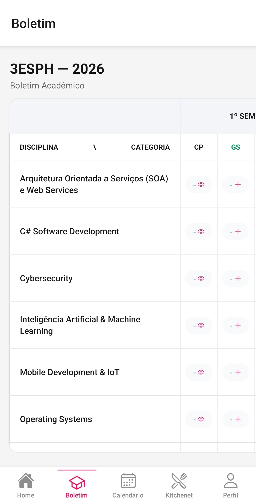

* Kitchenet

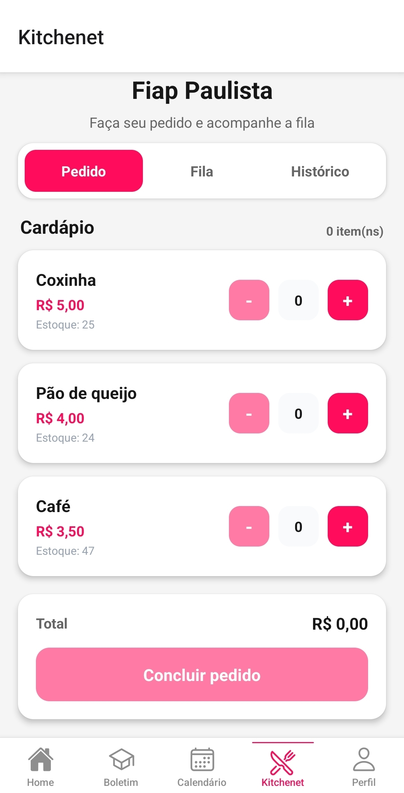
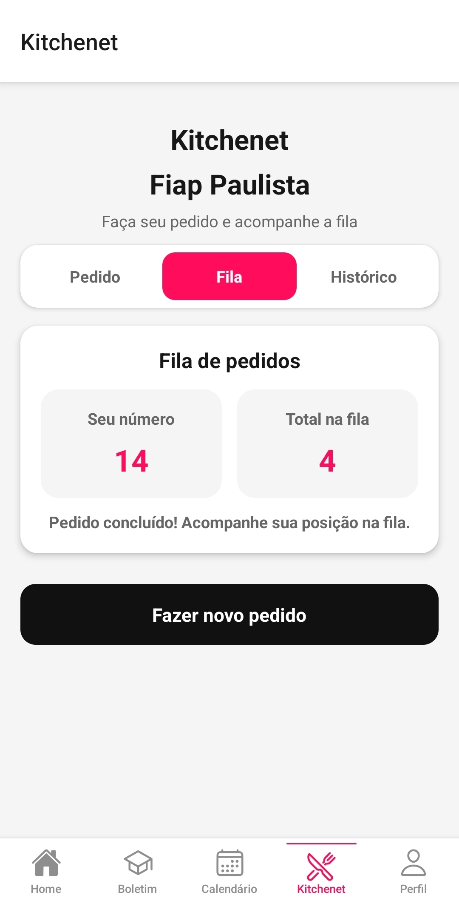
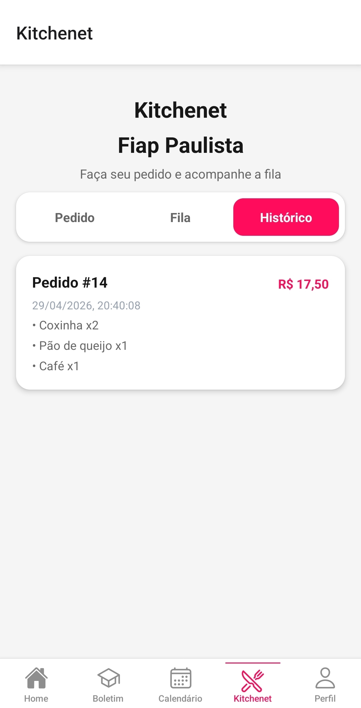

* Calendário Acadêmico

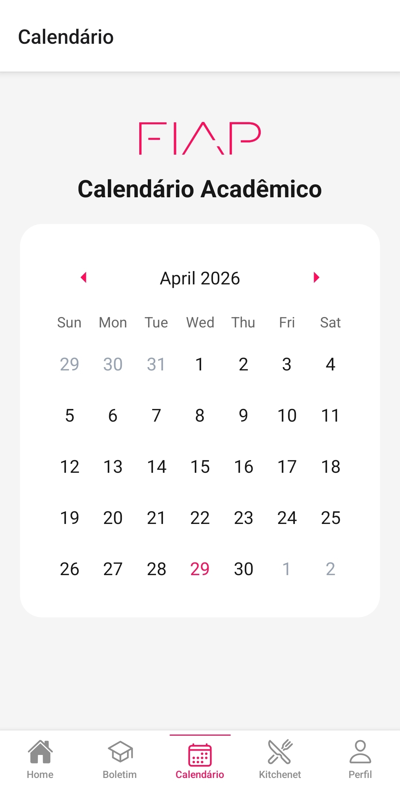

* Perfil

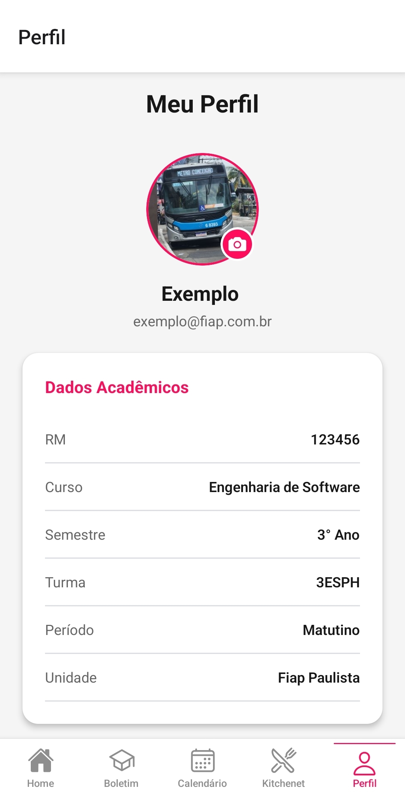
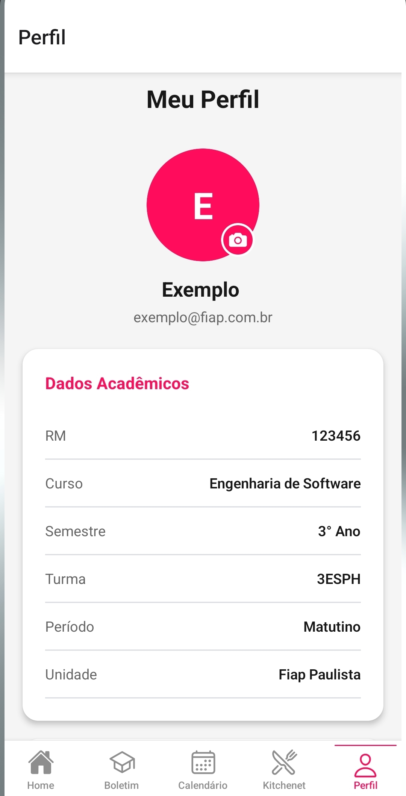


### 🎥 Vídeo do fluxo

* [Vídeo demonstrando o cadastro, login do aluno no aplicativo](./docs/demonstracao_aluno.mp4)
* [Vídeo demonstrando o cadastro, login do professor no aplicativo](./docs/demonstracao_professor.mp4)
* [Vídeo demonstrando a persistência do cadastro de eventos/boletim e visualização pelo aluno](./docs/verificar_cadastro_prof_no_aluno.mp4)

## 🧠 Decisões Técnicas

### 📂 Estrutura do Projeto

```
app/
 ├── (auth)/
 │   ├── login.jsx
 │   ├── register.jsx
 │   ├── complete_profile.jsx
 │
 ├── (tabs)/
 │   ├── index.jsx
 │   ├── bulletin.jsx
 │   ├── calendar_screen.jsx
 │   ├── canteen.jsx
 │   ├── profile.jsx

context/
 ├── AuthContext.js
 ├── ThemeContext.js
```


### 🔄 Contextos Utilizados

**AuthContext**

* Gerencia autenticação
* Armazena usuário logado
* Funções: login, cadastro, completar perfil

**ThemeContext**

* Gerencia cores do app
* Permite alternância de tema


### 🔐 Autenticação e Navegação Protegida

* Implementada com Context API
* Controle baseado no estado do usuário
* Rotas separadas:

  * `(auth)` → públicas
  * `(tabs)` → protegidas
* Redirecionamento automático quando não autenticado


### 💾 Persistência de Dados

Utilizado:

👉 `expo-secure-store`

#### Dados armazenados:

* Dados do usuário logado
* Boletim acadêmico
* Eventos do calendário

#### Chaves utilizadas:

```js
fiap_bulletin_<email>
fiap_calendar_events
```

## 🌟 Diferencial Implementado

### ⭐ Boletim Acadêmico Interativo com Perfis Dinâmicos

O sistema de boletim foi desenvolvido com comportamento adaptativo baseado no tipo de usuário (**Aluno ou Professor**), simulando um ambiente acadêmico real.


Esse diferencial melhora significativamente a experiência do usuário ao permitir:

* Interação entre perfis distintos
* Edição e visualização de dados em tempo real
* Simulação de um sistema acadêmico completo


### ⚙️ Implementação

* Controle via `role` (`student` | `teacher`)
* Professor pode editar notas e checkpoints
* Aluno apenas visualiza
* Interface adaptativa baseada no perfil


### 🧠 Regras implementadas

* Média automática dos 2 maiores CPs
* Cálculo automático de frequência (%)
* Atualização dinâmica da interface


### 💾 Persistência

* Dados salvos com `SecureStore`
* Separação por usuário:

```js
fiap_bulletin_<email>
```

## 🔮 Próximos Passos

* 🔔 **Notificações Push Inteligentes**: Implementar notificações para alertar sobre novas notas, eventos no calendário e limite de faltas, utilizando serviços como Expo Notifications.

* 🔌 **Integração com API REST**: Conectar o app a um backend real para sincronização de dados acadêmicos (usuários, notas e eventos), substituindo o armazenamento local por persistência em nuvem.

* 🛡️ **Autenticação com Biometria**: Adicionar login via impressão digital ou Face ID utilizando `expo-local-authentication`, aumentando a segurança e melhorando a experiência do usuário.

* 👨‍💼 **Cadastro e Gerenciamento via Admin**:Criar um fluxo administrativo onde professores ou administradores possam cadastrar alunos, gerenciar turmas e atribuir permissões, simulando um sistema acadêmico completo.

* ☁️ **Sincronização em Tempo Real**:  Implementar atualização automática dos dados entre diferentes usuários (ex: professor atualiza nota -> aluno vê instantaneamente), utilizando WebSockets ou Firebase.
